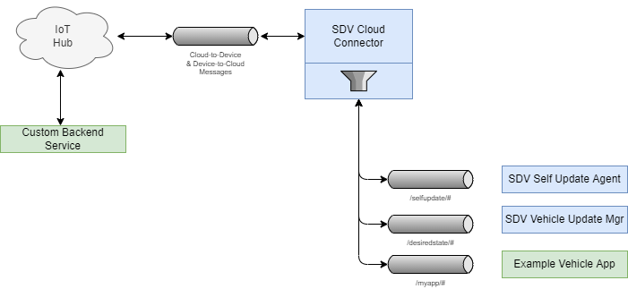

In order to verify that the device and the cloud connector can successfully receive messages sent by the cloud backend, we will send a dummy message to the device.

## Pre-Requisites

- Device is up and running, e.g by [running in qemu](/leda/docs/general-usage/running-qemu/)
- Eclipse Leda has successfully booted
- The device has been provisioned and configured, see [Device Provisioning](/leda/docs/device-provisioning/)

## Validating configuration

First, let's check that the cloud connection is active.

- Login as `root`
- Run sdv-health and check for the *SDV Connectivity* section:

    ```bash
    sdv-health
    ```

    

- Start watching the output of the cloud connector:

    ```bash
    kantui
    ```

- Select the `cloud-connector` container and press `L` to watch the logs

    > *Note:* When an unknown type of message is received, the cloud connector will log an error:
    >
    > ```text
    > 2022/04/13 16:04:41.911727  [agent]  ERROR  Handler returned error err="cannot deserialize cloud message: invalid character 'H' looking for beginning of value
    > ```

- Start watching on the MQTT message broker:

    ```bash
    mosquitto_sub -h localhost -t '#' --pretty -v
    ```

    > *Note:* When a known type of message is received, the cloud connector will forward the message to the MQTT broker into the corresponding topic `$appId/$cmdName`

## Sending a Device Message

- Go to the Web Console of Azure IoT Hub
- Select the device
- Click on "Send Message"
- Enter a C2D payload and click "Send"

Alternatively, on command line, use the Azure CLI client. Replace `DeviceId` and `IotHubName` with the appropriate names of your IoT Hub and device.

```bash
az iot device c2d-message send \
 --device-id ${DeviceID} \
 --hub-name ${IotHubName} \
 --data 'Hello World'
```
