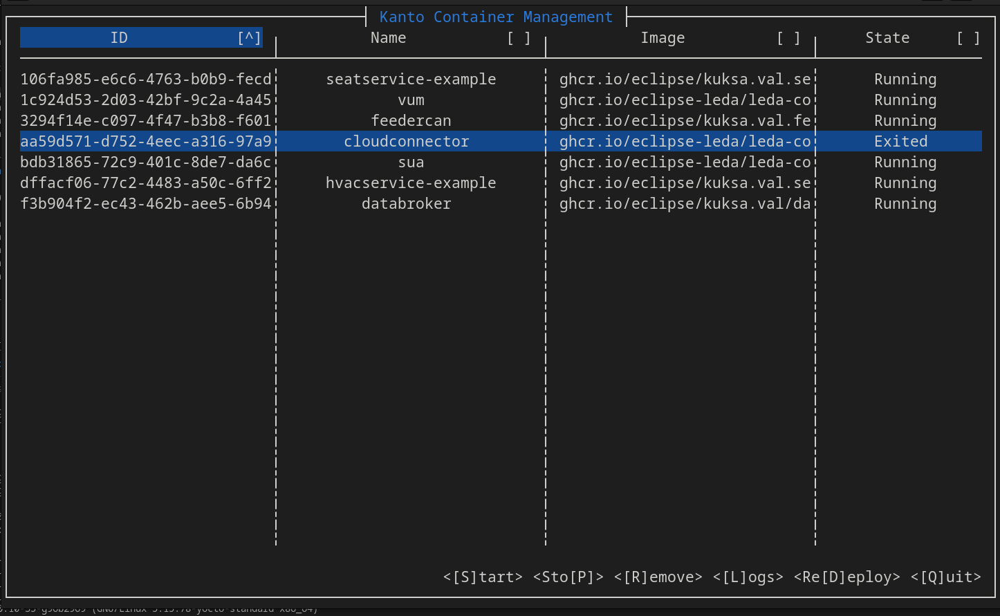

The quickstart image contains the following utilities:

- **sdv-health:** Show SDV software components health status
- **kantui:** A text user interface for kanto-cm to manage containers (start, stop, logs, redeploy all)
- **sdv-device-info:** Show and update device information
- **sdv-motd:** Message-of-the-Day shown after login prompt
- **can-forward:** Forwarding a CAN-bus network interface into a containerized Vehicle Application
- **kanto-auto-deployer:** Automatically deploys containers on boot. Runs as a systemd service, and can also be invoked by a user directly.

For details, please see [leda-utils](https://github.com/eclipse-leda/leda-utils/)

## Health check

The sdv-health utility displays a status overview of some important dependencies and device configurations for the SDV edge stack. The sdv health utility can be configured using the sdv.conf configuration file.

Usage:

    # sdv-health

Example output:

### Version Information

The Leda image version and build time will be displayed at the top in the first category:

- OS Release: Year and codename of the release version
- Image Version: Name of the image and more specific version information, such as the git tag or commit id
- Build timestamp in `yyyMMddHHmmss` notation

### Bus networks

If available, vehicle bus network information, such as the status of the CAN-Bus, will be displayed iin its own category. This helps to quickly identify if there problems with the hardware connectivity for automotive bus networks.

### Ports

The health utility checks the TCP ports of specific services. This helps to identify if these services are up and running and potentiallyconnectable via external network interfaces.

### Services and Containers

The services category shows the status of required and optional containers. The required containers are supposed to be up and running for the SDV.EDGE stack to be correctly up and running. If any of these core components have a failed state, the functionality is impacted.

The optional containers are for additional features and for example applications. These containers may not be necessary for each use case and hence will be marked as a warning if they are not up and running. The overview still helps to identify which containers are working properly.

### Errors, Warnings, Failed states

When there are errors or warnings related to the status of SDV related components, the health utility will print out these error states, and if available also a more detailed error message.

In the following example, the health utility helps the troubleshooting process:

- The container runtime is properly started: "Kanto CM" is OK in the "SDV Ports" section and the "container-management" service is OK in the "SDV Services" section".
- Some containers are in state "OK", which means there is no general issue with the container runtime.
- The cloud connector is in a "Stopped" state, which indicates that the user manually stopped the container by using "kanto-cm stop -n cloud-connector".
- The sua container is in a "Exited" state, which indicates the process exited with an error code.

## Kanto User Interface

The KantoUI tool is a text-based user interface for conveniently managing containers in the Kanto Container Management. It supports simple navigation using keyboard and mouse to select a specific container. Commands to start, stop, remove and re-deploy containers are available along with a functionality to retrieve the application logs of a selected container.

Usage:

    # kantui

Example output:

