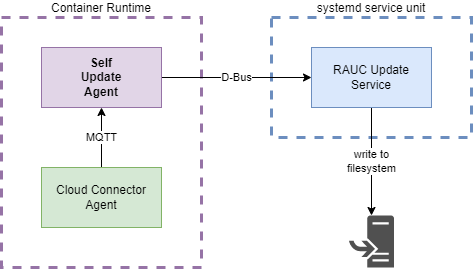

The self update agent is used in the context of [OTA Self Updates](/leda/docs/device-provisioning/self-update/).

## Overview

The Self Update Agent (SUA) as part of the [Eclipse Leda Incubator project proposal](https://projects.eclipse.org/projects/automotive.leda.ledaincubator/reviews/creation-review) is a software component responsible for **performing updates of system-level components of the connectivity device**, such as

- Boot Loader
- Operating System
- Device Firmware
- Hardware Drivers
- ... other parts of the system, which cannot be deployed as containerized packages or may require a reboot of the device.


## Implementation and Deployment

SUA is using the RAUC framework via D-Bus calls, but it is designed in a way that switching to other updating solution shall be possible. SUA may be controlled by an external higher-level orchestration component via defined MQTT messages, which carry necessary for update data, such as version and URL of the update bundle. Update process feedback and the end result are also communicated via defined MQTT messages. Software Update Agent is implemented in C++ and configured to be running inside of a container.



## Building

SUA can either be installed natively into the system image by using the respective Yocto recipe [leda-contrib-self-update-agent_git.bb](https://github.com/eclipse-leda/meta-leda/blob/main/meta-leda-components/recipes-sdv/eclipse-leda/leda-contrib-self-update-agent_git.bb), or can be deployed as a [container](https://github.com/eclipse-leda/leda-contrib-self-update-agent/pkgs/container/leda-contrib-self-update-agent%2Fself-update-agent).

### Native Installation

A native installation has the advantage that no additional container runtime is required. In some vehicle system architectures, there are separate devices for connectivity and for general computation. The actual physical device for connectivity may hence have less ressources available which then requires a native installation of such core components.

- Add the recipe to the image in your Yocto configuration:

```bash
    IMAGE_INSTALL += "leda-contrib-self-update-agent"
```

- The self update agent can be managed (start, stop, restart) using systemd: `systemctl restart self-update-agent`

### Container Installation

When the component can be deployed on the more generic compute module, where a container runtime is available, the self update agent can also be deployed as a container. This is the default for the Eclipse Leda quickstart images.

Initial deployment and configuration steps are:

- On first start, the auto deployment will deploy and start the self update agent container automatically.
- The self update agent will then connect to the locally running mosquitto server, awaiting update requests.
- The default configuration will use the location `/data/self-update-images/` to write and read update files.

## Source Repository

Source Repository: <https://github.com/eclipse-leda/leda-contrib-self-update-agent>
