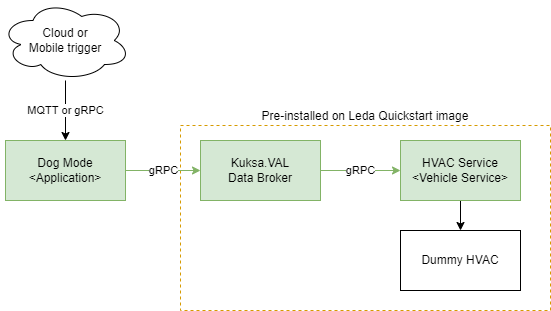

The **Dog Mode** use case has been derived from the [Eclipse Velocitas Dog Mode example](https://websites.eclipseprojects.io/velocitas/docs/about/use_cases/dog_mode/) and the [Eclipse Kuksa.VAL HVAC Service example](https://github.com/eclipse/kuksa.val.services/tree/main/hvac_service).

## Description

In the **Dog Mode** use case, an existing vehicle service (such as HVAC for Heating, Ventilation and Air Conditioning) is used for another use case.
When a driver enables the dog mode, the vehicle will keep the climate in a status to accomodates the pet while the driver is gone for a few minutes.

The focus on this example is to show how an additional application can reuse existing functionality for new use cases. The vehicle service being used does not need to be adapted for the new use case. The new use case is deployed as an additional functionality, separated from the rest of the existing system.

## Architecture Overview

- Cloud or mobile trigger: not part of the Leda image, but can be simulated by issueing MQTT messages
- Eclipse Velocitas - Vehicle Application: **Dog Mode** (to be deployed by user as part of the Velocitas tutorial)
- Eclipse Kuksa.VAL - Example Service: **HVAC Service** (pre-installed)
- Eclipse Kuksa.VAL - **Data Broker** (pre-installed)

## Getting started

1. Follow the Velocitas tutorial: build and deploy your clone of the [dog mode example](https://websites.eclipseprojects.io/velocitas/docs/about/use_cases/dog_mode/)
2. Download and run the Leda quickstart image
3. Deploy your seat adjuster application to the container runtime, either manually by using `kanto-cm create` or by providing a deployment descriptor in `/var/containers/manifests`. An example deployment descriptor can be found in [meta-leda-components](https://github.com/eclipse-leda/meta-leda/blob/main/meta-leda-components/recipes-sdv/eclipse-leda/kanto-containers/example/seatservice.json)
4. Ensure the databroker and the seat service containers are running and you know how to check their log files
5. Monitor vehicle data: `mosquitto_sub -t dogmode/display`
6. Enable dog mode by using the `databroker-cli`

        connect
        set Vehicle.Cabin.DogMode 1
